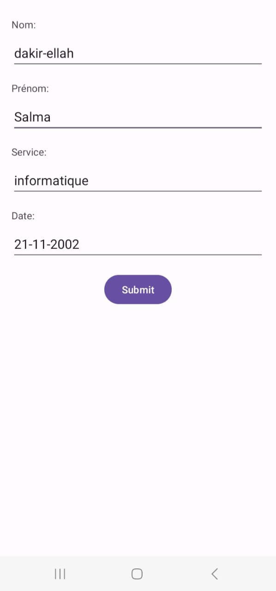

# Mobile_control
l'application mobile offre une interface mobile conviviale qui permet aux utilisateurs d'ajouter  des employes. Elle comporte des champs clairement libellés pour le nom, 
le prénom, la date de naissance et le service. 
Les utilisateurs peuvent saisir et stocker  facilement les données des employes .
les donnees seront stocker automatiquement dans la base de donnees.

# Capture d'ecran pour l'app mobile
  
